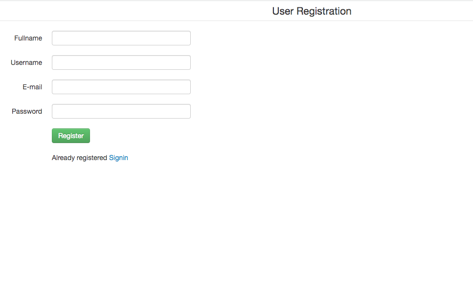

# Login Demo
> a login demo page based on php.
 <!-- If you have the project hosted somewhere, include the link here. -->

## Table of Contents
* [General Info](#general-information)
* [Screenshots](#screenshots)
* [Technologies Used](#technologies-used)
* [Project Status](#project-status)
* [Contact](#contact)
<!-- * [License](#license) -->

## General Information
- A simple PHP login page that will be extended with some more contents in a near future
<!-- You don't have to answer all the questions - just the ones relevant to your project. -->

## Screenshots

<!-- If you have screenshots you'd like to share, include them here. -->

## Technologies Used

   - php7
   - MySQL
   - Apache server

## Project Status
Project is: _in progress_ 

## Contact
Created by [@naigorc] - feel free to contact me!

<!-- Optional -->
<!-- ## License -->
<!-- This project is open source and available under the [... License](). -->

<!-- You don't have to include all sections - just the one's relevant to your project -->
